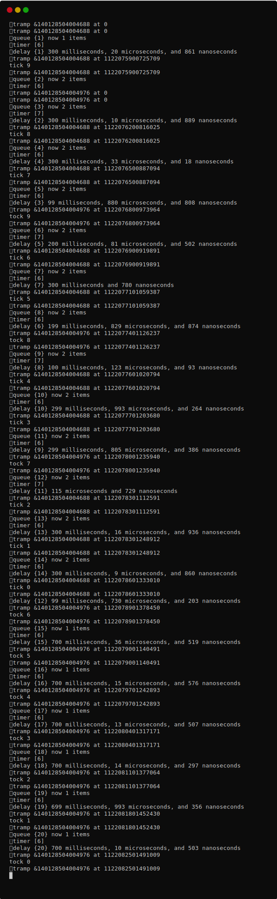
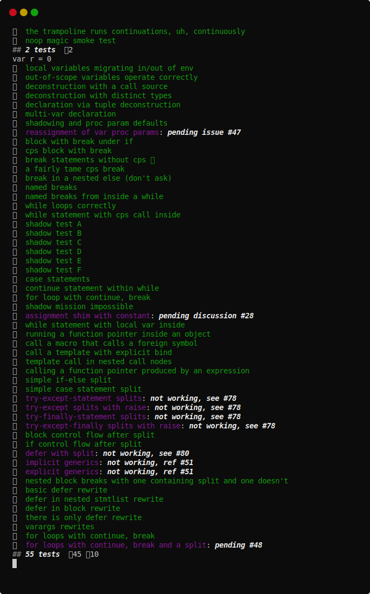
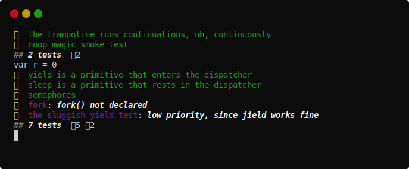
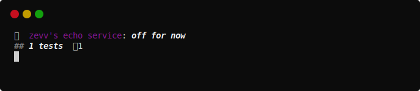
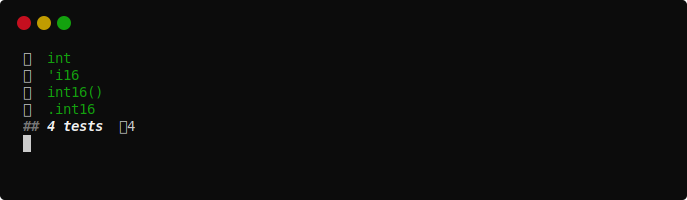

# Continuation-Passing Style

[](https://github.com/disruptek/cps/actions?query=workflow%3ACI)
[](https://github.com/disruptek/cps/releases/latest)

[](#license)

This project provides a macro `cps` which you can apply to a procedure to
rewrite it to use continuations for control-flow.

All runtime functionality is implemented in a dispatcher which you can replace
to completely change the type and behavior of your continuations.

For a description of the origins of this concept, see the included papers
and https://github.com/nim-lang/RFCs/issues/295, where we write in more
depth about why the implementation exists, what it aims to enable, etc.

## Why?

These continuations...

- compose efficient and idiomatic asynchronous code
- are over a thousand times lighter than threads
- are leak-free under Nim's ARC memory management
- may be based upon your own custom `ref object`
- may be dispatched using your own custom dispatcher
- may be moved between threads to parallelize execution
- require no `{.gcsafe.}` for global/local accesses
- are faster and lighter than async/await futures

## Work In Progress

The macro itself should be considered alpha quality. It is expected to
fail frequently, but it is in a state where we can begin to add tests and
refinement.

## Example Usage

The `cps` macro will use whatever return value you specify to determine the
type of your continuations. This type is typically a `ref object of RootObj` so
you can use it with inheritance.

The included sample `selectors`-based event queue is imported as
`cps/eventqueue` in this example, but again, this is something that you can
swap out with the implementation of your choice.

```nim
# all cps programs need the cps macro to perform the transformation
import cps

# but each usage of the .cps. macro can have its own dispatcher
# implementation and continuation type, allowing you to implement
# custom forms of async or use an existing library implementation
from cps/eventqueue import sleep, run, spawn, trampoline, Cont

# this procedure is written in a simple synchronous style, but when
# the .cps. is applied during compilation, it is rewritten to use
# the Cont type in a series of asynchronous continuations

proc tock(name: string; ms: int) {.cps: Cont.} =
  ## echo the `name` at `ms` millisecond intervals, ten times

  # a recent change to cps allows us to use type inference
  var count = 10

  # `for` loops are not supported yet
  while count > 0:

    dec count

    # the dispatcher supplied this primitive which receives the
    # continuation and returns control to the caller immediately
    sleep ms

    # subsequent control-flow is continues from the dispatcher
    # when it elects to resume the continuation
    echo name, " ", count

# NOTE: all the subsequent code is supplied by the chosen dispatcher

# the trampoline repeatedly invokes continuations until they
# complete or are queued in the dispatcher; this call does not block
trampoline tock("tick", ms = 300)

# you can also send a continuation directly to the dispatcher;
# this call does not block
spawn tock("tock", ms = 700)

# run the dispatcher to invoke its pending continuations from the queue;
# this is a blocking call that completes when the queue is empty
run()
```
...is rewritten during compilation to something like...

```nim
import cps
from cps/eventqueue import sleep, run, spawn, trampoline, Cont

type
  env_33554698 = ref object of Cont
    name_33554715: string
    ms_33554724: int
    count_33555007: int

proc loop_33555024(continuation: Cont): Cont
proc after_33555046(continuation: Cont): Cont

proc loop_33555024(continuation: Cont): Cont =
  if 0 < env_33554698(continuation).count_33555007:
    dec env_33554698(continuation).count_33555007
    continuation.fn = after_33555046
    return sleep continuation, env_33554698(continuation).ms_33554724

proc after_33555046(continuation: Cont): Cont =
  echo env_33554698(continuation).name_33554715, " ",
       env_33554698(continuation).count_33555007
  continuation.fn = loop_33555024
  return continuation

proc tock(continuation: Cont): Cont =
  env_33554698(continuation).count_33555007 = 10
  continuation.fn = loop_33555024
  return continuation

proc tock(name: string; ms: int): Cont =
  result = env_33554698(fn: tock, ms_33554724: ms, name_33554715: name)

trampoline tock("tick", ms = 300)

spawn tock("tock", ms = 700)

run()
```
...and when built with `--define:cpsDebug`, outputs something like...



[The source to the tick-tock test.](https://github.com/disruptek/cps/blob/master/tests/tock.nim)

## Notes on the Example Dispatcher

The included dispatcher is based upon
[selectors](https://nim-lang.org/docs/selectors.html), so you can see how the
features of that module will support typical I/O operations with CPS.

Windows is not supported by the sample dispatcher yet due to the lack of
native timer support in `selectors`, but [an ioselectors package that supports
Windows](https://github.com/xflywind/ioselectors) is in an advanced stage of
development.

## Hacking

- use `--define:cpsDebug` to get extra debugging output
- use `--define:cpsTrace` to get continuation tracing from the trampoline
- use `--define:cpsCast` to `cast` continuations (versus type conversion)
- use `--define:cpsTree` to dump AST via `treeRepr` in `cpsDebug` mode
- use `--define:cpsExcept` catch exceptions and stash them in the continuation
- use `--define:cpsMutant` toggle mutating continuations (default: _off_)

## Documentation

See [the documentation for the cps module](https://disruptek.github.io/cps/cps.html) as generated directly from the source.
You can also jump to [the documentation for the included dispatcher](https://disruptek.github.io/cps/cps/eventqueue.html).

## Tests

The tests provide the best examples of usage and are a great starting point for
your experiments.

[Here are some tests that Zevv prepared:](https://github.com/disruptek/cps/blob/master/tests/tzevv.nim)



[Here are more contrived tests of AST rewrites:](https://github.com/disruptek/cps/blob/master/tests/taste.nim)



[Here are a few tests of the included eventqueue dispatcher:](https://github.com/disruptek/cps/blob/master/tests/teventqueue.nim)



[Here's Zevv's echo server test:](https://github.com/disruptek/cps/blob/master/tests/techo.nim)



[Finally, here are a few quick tests of type conversions:](https://github.com/disruptek/cps/blob/master/tests/ttypes.nim)



## License
MIT
