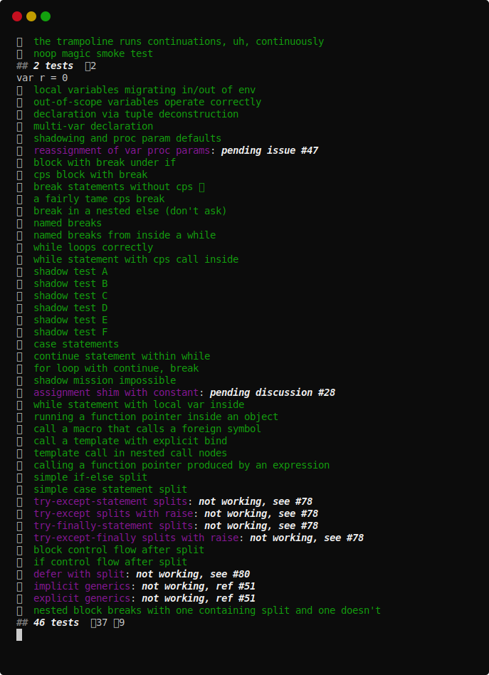

# Continuation-Passing Style

[](https://github.com/disruptek/cps/actions?query=workflow%3ACI)
[](https://github.com/disruptek/cps/releases/latest)

[](#license)

This project provides a macro `cps` which you can apply to a procedure to
rewrite it to use continuations for control-flow.  A substantial effort to
demystify this style of programming lives at https://github.com/zevv/cpsdoc.

All runtime functionality is implemented in a dispatcher which you can replace
to completely change the type and behavior of your continuations.

For a description of the origins of this concept, see the included papers
and https://github.com/nim-lang/RFCs/issues/295, where we write in more
depth about why the implementation exists, what it aims to enable, etc.

## What Are Continuations For?

The continuations produced by this macro...

- compose efficient and idiomatic asynchronous code
- are over a thousand times lighter than threads
- are leak-free under Nim's ARC/ORC memory management
- may be based upon your own custom `ref object`
- may be dispatched using your own custom dispatcher
- may be moved between threads to parallelize execution
- are faster and lighter than async/await futures
- have nearly zero overhead versus closure iterators

## This is Work In Progress!

The macro itself should be considered beta quality.  Corner-cases are being
nailed down and the API is being adjusted as demonstration applications are
built and rough edges are identified.

## How Do I Use It?

The `cps` macro will use whatever return value you specify to determine the
type of your continuations. This type is typically a `ref object of RootObj` so
you can use it with inheritance.

```nim
# all cps programs need the cps macro to perform the transformation
import cps

# but each usage of the .cps. macro can have its own dispatcher
# implementation and continuation type, allowing you to implement
# custom forms of async or use an existing library implementation
#
# here we use a reference dispatcher (see below)
from eventqueue import sleep, run, spawn, trampoline, Cont

# this procedure is written in a simple synchronous style, but when
# the .cps. is applied during compilation, it is rewritten to use
# the Cont type in a series of asynchronous continuations

proc tock(name: string; ms: int) {.cps: Cont.} =
  ## echo the `name` at `ms` millisecond intervals, ten times

  # a recent change to cps allows us to use type inference
  var count = 10

  # `for` loops are not supported yet
  while count > 0:

    dec count

    # the dispatcher supplied this primitive which receives the
    # continuation and returns control to the caller immediately
    sleep ms

    # subsequent control-flow is continues from the dispatcher
    # when it elects to resume the continuation
    echo name, " ", count

# NOTE: all the subsequent code is supplied by the chosen dispatcher

# the trampoline repeatedly invokes continuations until they
# complete or are queued in the dispatcher; this call does not block
trampoline tock("tick", ms = 300)

# you can also send a continuation directly to the dispatcher;
# this call does not block
spawn tock("tock", ms = 700)

# run the dispatcher to invoke its pending continuations from the queue;
# this is a blocking call that completes when the queue is empty
run()
```

[The source to the tick-tock test.](https://github.com/disruptek/eventqueue/blob/master/tests/tock.nim)

## Notes on the Example Dispatcher

An example dispatcher was included in the past, but demonstrating dispatch
conflated the purpose of the `cps` macro and made misconceptions about the role
of continuation-versus-dispatcher common. An example dispatcher can now be
found at https://github.com/disruptek/eventqueue and you can also jump directly
to [the documentation](https://disruptek.github.io/eventqueue/eventqueue.html)
if it helps.

## Hacking

- use `--define:cpsDebug` to get extra debugging output
- use `--define:cpsTrace` to get continuation tracing from the trampoline
- use `--define:cpsTree` to dump AST via `treeRepr` in `cpsDebug` mode

## Documentation

See [the documentation for the cps module](https://disruptek.github.io/cps/cps.html) as generated directly from the source.

## Tests

The tests provide the best examples of usage and are a great starting point for
your experiments.

[Here are some tests that Zevv prepared:](https://github.com/disruptek/cps/blob/master/tests/tzevv.nim)


[Here are more contrived tests of AST rewrites:](https://github.com/disruptek/cps/blob/master/tests/taste.nim)



## License
MIT
